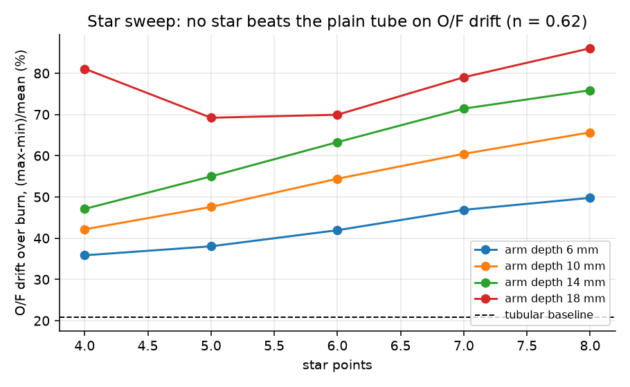
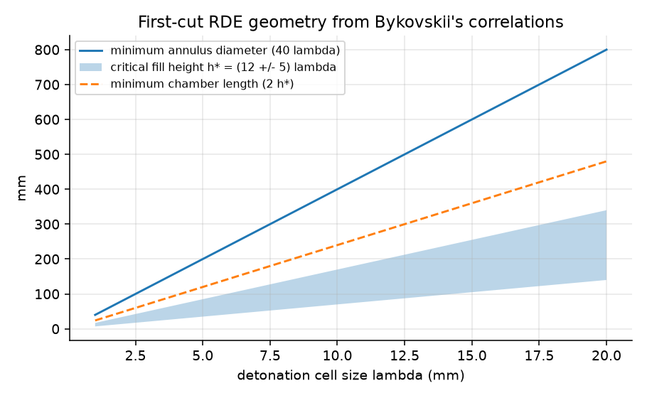
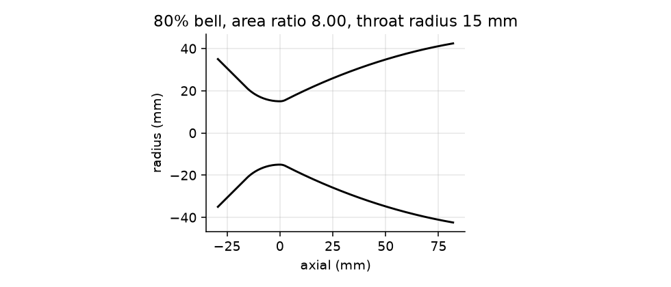

# hybrid-motor-lab

**Solid, hybrid and detonation rocket propulsion models in Python: real thermochemistry, arbitrary (3D-printable) grain shapes, O/F control, and a printable nozzle as CAD.**

[](https://github.com/aneeshkaravadi/hybrid-motor-lab/actions/workflows/ci.yml)


## What this shows

| Result | Number | How it was checked |
|---|---|---|
| Combustion temperature (H₂/O₂, CH₄/air, CH₄/O₂, 1 atm) | 3077 / 2225 / 3052 K | textbook 3080 / 2226 / 3050 K |
| Chapman–Jouguet detonation speed (H₂/O₂, H₂/air, C₂H₄/air) | 2837 / 1969 / 1824 m/s | published 2836 / 1968 / 1825 m/s |
| Burn-back perimeter of a circular port | within 0.1% mid-burn | exact $2\pi(r_0+x)$ |
| BATES burning area | within 1% | closed form |
| Solid-motor mass balance | within 3% | propellant loaded vs mass expelled |
| Bell nozzle | ε = 8.000, metal-PBF printable | DfAM check on the exported STL |

All 18 checks run in CI (`tests/test_physics.py`).

### Finding 1: for a paraffin hybrid, port shape cannot hold O/F steady, but throttling or a graded printed fuel can

The fuel regresses at $\dot r = aG^n$. For any port that grows self-similarly, $O/F \propto A^{\,n-1/2}$, so with paraffin's $n = 0.62$, O/F must rise during the burn ([derivation](DERIVATIONS.md#5-hybrid-motor-of-drift-and-how-to-stop-it-hybridpy)).

Stars, finocyls and wagon wheels all front-load fuel flow. That gives 3–5% more total impulse than a tube, but O/F swings 70–88% over the burn instead of 21%.

A 20-design star sweep confirms that **none** beats the plain tube on O/F drift:



What does work is inverting the model. To hold O/F at 2.49 the motor needs either:
- an oxidizer throttle schedule from 0.73 to 0.41 kg/s, or
- a fuel whose regression coefficient rises from 0.87× to 1.07× from the port outward. That is a radially graded grain, which only additive manufacturing can make.


### Finding 2: detonation does work even with no compressor

The detonation speed comes from full equilibrium chemistry. A one-gamma model calibrated to that speed then compares three ideal cycles on H₂/air:
- **Fickett–Jacobs** (detonation): 25% thermal efficiency at a pressure ratio of 1
- **Humphrey** (constant-volume combustion): 23%
- **Brayton** (conventional constant-pressure combustion): 0%

The detonation's own pressure rise does the compressor's job. This is the case for rotating detonation engines.

 

RDE sizing uses Bykovskii's empirical correlations, which depend on the detonation cell size λ. λ has to come from experiments, so the plot sweeps it rather than inventing a value. The code also flags annuli that are too small for the chosen mixture.

### Finding 3: same motor case, four thrust profiles


These are four grain designs in the same 54 mm case: neutral BATES, a progressive tube, a fast star with a sliver tail-off, and a boost–sustain stack. The propellant constants are illustrative, not a real formulation. `examples/compare_static_fire.py` fits the burn-rate law to a measured curve (load-cell CSV, or RASP `.eng` files from thrustcurve.org).

### A nozzle you can print

`hml.nozzle` turns the contour into a solid with [build123d](https://github.com/gumyr/build123d) and writes [`cad/bell_nozzle_e8.step`](cad/bell_nozzle_e8.step). The [DfAM report](docs/dfam_report.md) measures the exported mesh against metal laser powder-bed fusion limits:
- it is watertight
- its thinnest wall is 2.6 mm against a 0.4–0.5 mm minimum
- printed exit-up, only 2.5% of its surface needs support



## Quick start

```bash
git clone https://github.com/aneeshkaravadi/hybrid-motor-lab && cd hybrid-motor-lab
pip install -e ".[dev,cad]"
pytest -q                          # 18 physics checks, ~5 s
python examples/make_figures.py    # every figure and number above, ~30 s
```

```python
from hml import thermo, rde

perf = thermo.rocket(thermo.bipropellant(thermo.O2, thermo.PARAFFIN, of=2.2), pc=2e6, area_ratio=5)
print(perf.cstar, perf.isp_vac)          # ~1815 m/s, shifting equilibrium

cj = rde.cj_state(thermo.bipropellant(thermo.AIR, thermo.H2, of=34.06))
print(cj.D, cj.P2 / cj.P1)               # 1969 m/s, 15.6x pressure rise
```

## How it works

| Module | What it does |
|---|---|
| `thermo.py` | Adiabatic equilibrium combustion and frozen or shifting nozzle expansion (the NASA CEA "rocket" problem), solved with [Cantera](https://cantera.org) and NASA thermo data |
| `grain.py` | Burn-back of any port shape: a sub-pixel boundary, a distance field, then $P = dA/dx$ |
| `solid.py` | Quasi-steady solid-motor ballistics, $P_c = (\rho_p a A_b c^*/A_t)^{1/(1-n)}$ |
| `hybrid.py` | Hybrid ballistics with $\dot r = aG^n$, plus the inverse problems (throttle schedule, graded fuel) |
| `rde.py` | Chapman–Jouguet detonation state, one-gamma cycle efficiencies, Bykovskii RDE sizing |
| `nozzle.py` | One-gamma $C_F$, Rao-style bell contour, STEP/STL export |

Every equation is derived in [DERIVATIONS.md](DERIVATIONS.md), together with what the models leave out.

> [!NOTE]
> These are design-study models, not flight-qualification tools. The limitations are listed at the end of DERIVATIONS.md.

## About

Built by **Aneesh Karavadi**, an engineering student at the University of North Texas (Texas Academy of Mathematics and Science). I used **Claude Code** as a pair programmer. The physics choices, validation targets and conclusions are mine to defend, and the tests show where each one comes from.

Companion notes for specific teams are in [`docs/`](docs/).
