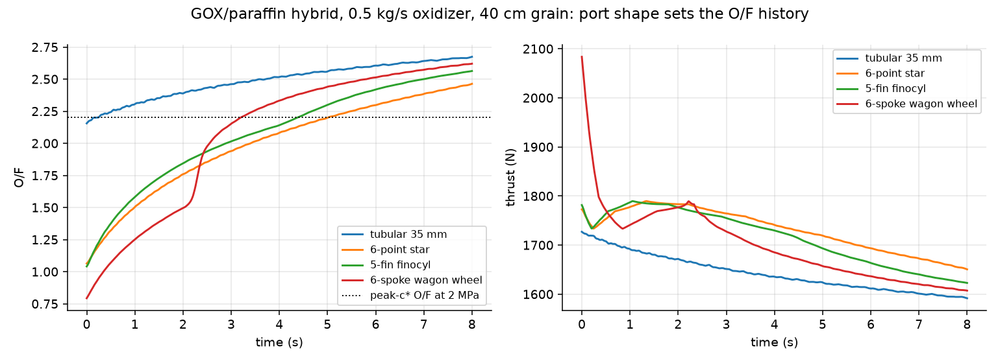
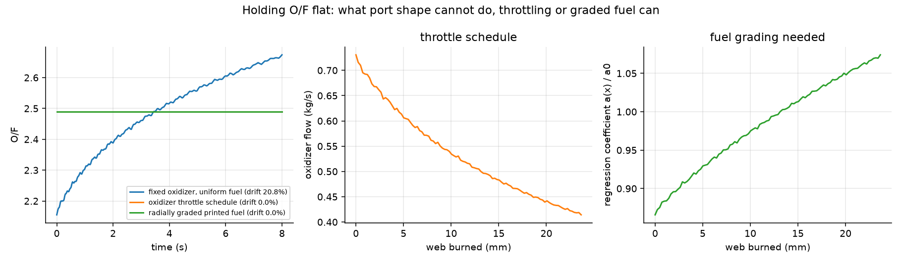
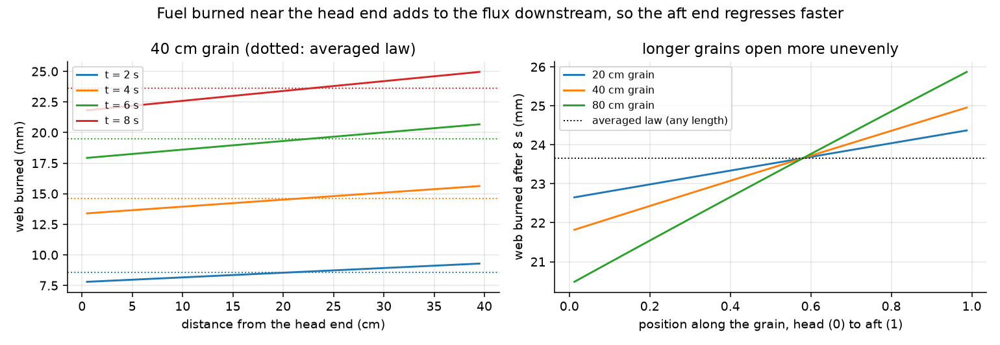
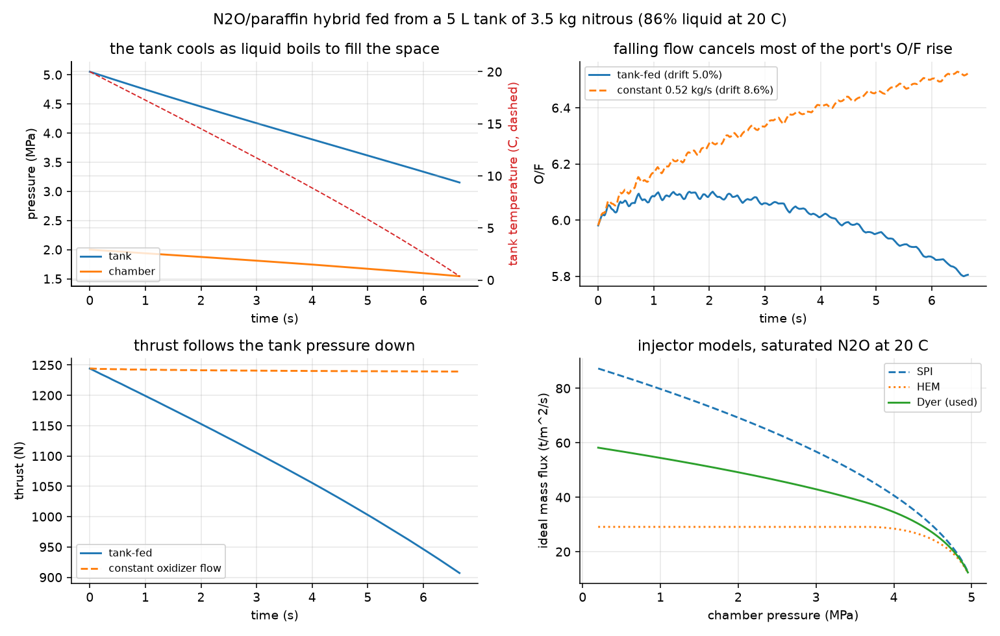
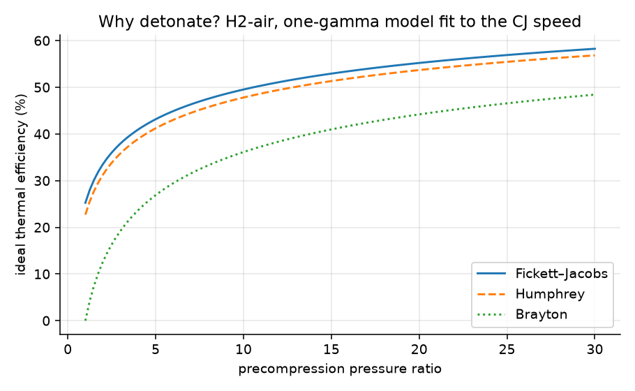
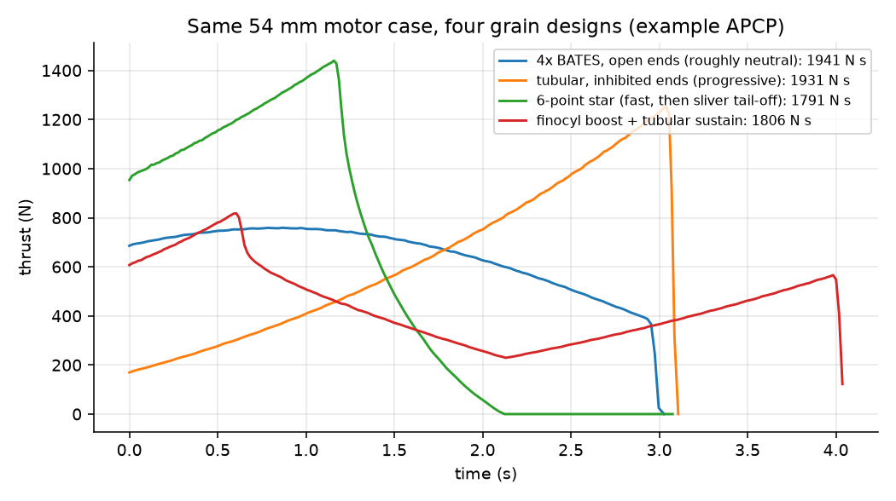

# hybrid-motor-lab

[](https://github.com/aneeshkaravadi/hybrid-motor-lab/actions/workflows/ci.yml)

Rocket motor models in Python, from the combustion chemistry all the way to a nozzle you can 3D print. It covers solid motors, hybrids, and a detour into rotating detonation engines.

<!-- TODO(Aneesh): photo of the club rocket / motor here, e.g.

-->

## Why I built this

I led propulsion design for my high school's rocketry club, where we built and launched high-power rockets, and I wanted to be able to compute a motor's thrust curve myself from the grain shape and the propellant instead of only reading it off a datasheet. Once the solid-motor part worked, hybrids were the obvious next step, because a 3D-printed fuel grain can have any port shape you want. The detonation part came from wanting to understand why anyone would build an engine around detonations in the first place.

## What's in it

- `thermo.py`: equilibrium combustion and nozzle expansion with [Cantera](https://cantera.org), basically the NASA CEA "rocket" problem
- `grain.py`: burn-back for any port shape you can describe (tube, star, finocyl, wagon wheel, or your own function)
- `solid.py` and `hybrid.py`: quasi-steady ballistics, including fuel regression $\dot r = aG^n$ for hybrids, either averaged over the port or marched along it
- `tank.py`: a self-pressurizing nitrous oxide tank and injector feeding the hybrid, with [CoolProp](http://coolprop.org) for the nitrous properties
- `rde.py`: Chapman–Jouguet detonation states, ideal cycle comparison, and rough RDE sizing
- `nozzle.py`: a Rao-style bell contour that exports straight to STEP

The math behind all of it is written out in [DERIVATIONS.md](DERIVATIONS.md).

## The result I didn't expect

I assumed printed port shapes would let you hold a hybrid's O/F ratio steady through the burn, since that was the whole appeal. They don't, at least not for paraffin. Every star, finocyl and wagon wheel I tried front-loaded the fuel flow, which helped thrust a little (3 to 5% more impulse), but made the O/F swing much worse than a plain tube (70 to 88% instead of 21%).



It took me a while to see why. For any port that grows into a scaled copy of itself, O/F goes like $A^{n-1/2}$, and paraffin has $n = 0.62$, so O/F has to rise no matter what shape you start with. I ran a sweep of 20 star designs to be sure and none of them beat the tube.

What does work is running the model backwards. To hold O/F flat you either throttle the oxidizer down over the burn (0.73 to 0.41 kg/s for my test case), or you print a fuel whose regression rate increases by about 24% from the port outward. That second one is a fuel grain you could only make by printing it.



## Where the port actually opens

The paraffin regression law I use is a fit against the oxidizer flux averaged over the whole grain, so the model burns every slice of the port at the same rate. Really, the fuel that burns near the head end flows down the port too, so the mass flux, and with it the regression rate, grows toward the aft end. So I also march along the port with the total flux. Inside one slice the flux equation integrates exactly, so there's no step-size error along the grain, and a test checks it against a numerical ODE solve.

To compare fairly, I matched the two models at ignition. A total-flux law needs a smaller coefficient to give the same starting fuel flow (0.88 of the published one for the 40 cm grain). After 8 s, the averaged law says the port has opened 23.6 mm everywhere. Marching along it, the head end has burned 21.8 mm and the aft end 25.0 mm, because the aft end starts out regressing 26% faster. In an 80 cm grain that's 49% faster, and the aft end burns 25.9 mm. So if I sized the casing liner from the averaged number, the aft end would eat 1.4 mm of the margin in the 40 cm grain and 2.3 mm in the 80 cm one.



## Feeding it from a nitrous tank

Most amateur and university hybrids don't get a steady oxidizer flow. They run on nitrous oxide, which sits in the tank as a liquid under its own vapor pressure, about 5 MPa at room temperature, so it doesn't need a pressurant gas. The catch is that as liquid leaves, some of what's left boils to fill the space, and that cools the whole tank down. Colder nitrous has a lower vapor pressure, so the feed pressure falls through the burn.

I modeled the tank as liquid and vapor in equilibrium at one temperature, tracked its mass and energy with CoolProp's equation of state for nitrous, and fed a paraffin grain through an injector. Over a 6.65 s burn the tank drops from 20 °C to 0.4 °C, and its pressure from 5.05 to 3.15 MPa. The oxidizer flow falls 23% and the thrust 27%.

What surprised me was the O/F. With a constant oxidizer flow, the opening port pushes O/F up 9% over the burn. Fed from the tank, the falling flow cancels most of that, and O/F stays within 5%. The tank throttles itself down, which is what I had to compute a throttle schedule for in the GOX case. It helps that this regression law's $n = 0.555$ is close to 1/2, where the port barely moves O/F at all.



Two practical things fell out of it. When the liquid runs out, 0.43 kg of the 3.5 kg load is still in the tank as vapor, which my model doesn't burn. And the injector model matters. At 2 MPa chamber pressure, Dyer's model gives 71% of the flow the simple liquid-only (SPI) formula does, because the nitrous starts boiling on its way through the holes. Holes sized with the liquid-only formula would leave the motor about 30% short on oxidizer.

The paraffin/N₂O regression law comes from a McGill Rocket Team report ([arXiv:2302.06725](https://arxiv.org/abs/2302.06725)), which takes it from a 2013 thesis, and that report's own two hot fires fit very different numbers. So I'd treat the O/F values as a starting point.

## Detonation, briefly

The detonation speeds from my CJ solver land within 1 m/s of published values for H₂/O₂, H₂/air and C₂H₄/air, which was the moment I started trusting it. The interesting part is the cycle comparison. For H₂/air with no compressor at all, an ideal detonation cycle still gets about 25% thermal efficiency while a normal constant-pressure (Brayton) cycle gets zero, because the detonation does its own compression. That's the argument for RDEs in one plot.



The sizing part depends on the detonation cell size, which you can't really calculate and have to get from experiments, so I sweep it instead of pretending to know it.

## Solid motors

Same 54 mm case, four grain designs, four very different thrust curves. The propellant numbers here are illustrative, not a real formulation.



<!-- TODO(Aneesh): once you have real data, add a section here, e.g.
## Checking it against real motors
Fit a and n on one motor with examples/compare_static_fire.py, then predict a second motor of the same propellant
(thrustcurve.org .eng file or club static-fire CSV in data/static_fires/). Show the overlay plot and the impulse error.
-->

## A nozzle that ends in hardware

`nozzle.py` builds the bell contour and exports it with build123d as [`cad/bell_nozzle_e8.step`](cad/bell_nozzle_e8.step). I ran the exported mesh through a DfAM check for metal powder-bed printing ([report](docs/dfam_report.md)). Walls pass easily, and standing it on its flange cuts the support area from 18% to 2.5%.

<!-- TODO(Aneesh): screenshot of the STEP open in SolidWorks/Fusion, e.g.

-->

## Things I got wrong along the way

- My first burn-back version used a plain pixel distance transform, and it overestimated the burning perimeter by about 10% early in the burn, because the flame front ends up being a bunch of tiny circles around boundary pixels. I switched to finding the boundary at sub-pixel accuracy and measuring distances to that, which got it to within 0.1% of the exact circle.
- The first nozzle STEP file was in meters while CAD programs assume millimeters, so it opened 1000 times too small, and the STL was 78 MB. Building the geometry in mm with spline walls fixed both (the STEP is now 69 KB).
- I labeled one of my solid grain cases "near-neutral star" before actually looking at the curve. It isn't neutral at all, so it's now labeled for what it does.
- The exit-pressure solver crashed with a negative temperature because I let it search down to absurdly low pressures, so the bracket now scales with the area ratio.

## Running it

```bash
pip install -e ".[dev,cad]"
pytest -q                          # 26 checks against known answers, a few seconds
python examples/make_figures.py    # regenerates every figure and number above
```

The tests compare against things I could look up independently: textbook flame temperatures, published CJ speeds, the exact BATES burning area, isentropic flow tables, a mass balance on the solid motor, an ODE solve of the fuel flow along a hybrid port, and a second, independent formulation of the nitrous tank drain.

## What's next

Things I want to add are tracked in [issues](https://github.com/aneeshkaravadi/hybrid-motor-lab/issues): validation against real static-fire data, erosive burning, and condensed products for aluminized propellants.

---

Aneesh Karavadi, dual-enrolled engineering student at UNT through TAMS. I used Claude Code to write a lot of the implementation, but I picked the problems and the validation targets, and I checked the results, so the mistakes are mine.
